# Common Platform Contract Management Service

## Table of Contents
- Overview
- Features
- Architecture
  - Modules
  - Technology Stack
- Data Model
- API Documentation
- Setup and Installation
  - Prerequisites
  - Local Development Setup
  - Docker Deployment
- Configuration
- Profiles
- Caching
- Development Guidelines
- Contributing

## Overview
The Common Platform Contract Management Service is a microservice that provides comprehensive contract management capabilities for the Firefly platform. It enables the creation, tracking, and management of contracts, including their terms, parties, documents, events, and risk assessments.

## Features
- Contract lifecycle management
- Contract terms and conditions tracking
- Contract party management
- Document management integration
- Contract event tracking
- Risk assessment and monitoring
- RESTful API with comprehensive documentation

## Architecture
This microservice follows a modular architecture with clear separation of concerns:

### Modules
- **common-platform-contract-mgmt-interfaces**: Contains DTOs and API interfaces
- **common-platform-contract-mgmt-models**: Contains database entities and repositories
- **common-platform-contract-mgmt-core**: Contains business logic and service implementations
- **common-platform-contract-mgmt-web**: Contains REST controllers and web configuration
- **common-platform-contract-mgmt-sdk**: Generated OpenAPI client SDK and docs

### Technology Stack
- Java 21
- Spring Boot
- Spring WebFlux (Reactive programming)
- Spring Data R2DBC (Reactive PostgreSQL)
- Flyway for database migrations
- Caffeine (dev/testing) and Redis (prod) as cache providers
- Virtual threads (Spring threads.virtual) enabled
- Maven for dependency management
- Docker for containerization
- springdoc-openapi (Swagger UI) for API documentation

## Data Model
Below is the complete entity-relationship diagram, modeled in Mermaid and including attributes (with types) and relationships. Read-only fields are noted with [read-only].

```mermaid
classDiagram
  direction TB

  class Contract {
    +Long contractId [read-only]
    +String contractNumber
    +Long productCatalogId
    +Long productId
    +ContractStatusEnum contractStatus
    +LocalDateTime startDate
    +LocalDateTime endDate
    +String documentManagerRef
    +LocalDateTime dateCreated [read-only]
    +LocalDateTime dateUpdated [read-only]
  }

  class ContractParty {
    +Long contractPartyId [read-only]
    +Long contractId
    +Long partyId
    +Long roleInContractId
    +LocalDateTime dateJoined
    +LocalDateTime dateLeft
    +Boolean active
    +LocalDateTime dateCreated [read-only]
    +LocalDateTime dateUpdated [read-only]
  }

  class ContractDocument {
    +Long contractDocumentId [read-only]
    +Long contractId
    +String documentType
    +String documentManagerRef
    +LocalDateTime dateAdded
    +LocalDateTime dateCreated [read-only]
    +LocalDateTime dateUpdated [read-only]
  }

  class ContractStatusHistory {
    +Long contractStatusHistoryId [read-only]
    +Long contractId
    +StatusCodeEnum statusCode
    +LocalDateTime statusStartDate
    +LocalDateTime statusEndDate
    +LocalDateTime dateCreated [read-only]
    +LocalDateTime dateUpdated [read-only]
  }

  class ContractTerm {
    +Long contractTermId [read-only]
    +Long contractId
    +TermTypeEnum termType
    +String termDescription
    +BigDecimal numericValue
    +String valueUnit
    +LocalDateTime effectiveDate
    +LocalDateTime expirationDate
    +LocalDateTime dateCreated [read-only]
    +LocalDateTime dateUpdated [read-only]
  }

  class ContractEvent {
    +Long contractEventId [read-only]
    +Long contractId
    +EventTypeEnum eventType
    +LocalDateTime eventDate
    +String eventDescription
    +String documentManagerRef
    +LocalDateTime dateCreated [read-only]
    +LocalDateTime dateUpdated [read-only]
  }

  class ContractRiskAssessment {
    +Long contractRiskAssessmentId [read-only]
    +Long contractId
    +BigDecimal riskScore
    +RiskLevelEnum riskLevel
    +LocalDateTime assessmentDate
    +String assessor
    +String notes
    +LocalDateTime dateCreated [read-only]
    +LocalDateTime dateUpdated [read-only]
  }

  class ContractStatusEnum {
    <<enumeration>>
    DRAFT
    PENDING
    ACTIVE
    SUSPENDED
    CLOSED
    CANCELLED
  }

  class StatusCodeEnum {
    <<enumeration>>
    DRAFT
    ACTIVE
    DELINQUENT
    DEFAULT
    CLOSED
    CANCELLED
  }

  class TermTypeEnum {
    <<enumeration>>
    INTEREST_RATE
    CREDIT_LIMIT
    FEE_SCHEDULE
    PAYMENT_SCHEDULE
    PENALTY_RATE
  }

  class EventTypeEnum {
    <<enumeration>>
    RENEWAL
    AMENDMENT
    CANCELLATION
    SUSPENSION
    REACTIVATION
    TERMINATION
  }

  class RiskLevelEnum {
    <<enumeration>>
    LOW
    MEDIUM
    HIGH
    CRITICAL
  }

  Contract "1" --> "0..*" ContractParty : has
  Contract "1" --> "0..*" ContractDocument : has
  Contract "1" --> "0..*" ContractStatusHistory : has
  Contract "1" --> "0..*" ContractTerm : has
  Contract "1" --> "0..*" ContractEvent : has
  Contract "1" --> "0..*" ContractRiskAssessment : has
```



Validation and filtering notes:
- Dates are validated via @ValidDate
- Risk score validated via @ValidInterestRate
- Identifiers marked with @FilterableId are supported as query filters

Notable recent changes:
- Added productCatalogId to Contract and associated DB migrations.
- Updated ContractParty to use roleInContractId.
- Removed product_type enum references.

## API Documentation
The service provides a RESTful API with the following main endpoints:
- `/api/v1/contracts`: Contract management
- `/api/v1/contracts/{contractId}/parties`: Contract party management
- `/api/v1/contracts/{contractId}/documents`: Contract document management
- `/api/v1/contracts/{contractId}/terms`: Contract term management
- `/api/v1/contracts/{contractId}/events`: Contract event management
- `/api/v1/contracts/{contractId}/risk-assessments`: Contract risk assessment management

Detailed API documentation is available via Swagger UI at `/swagger-ui.html` when the service is running. Note: in the `prod` profile, OpenAPI endpoints and Swagger UI are disabled per configuration.

## Setup and Installation

### Prerequisites
- Java 21
- Maven 3.8+
- PostgreSQL 14+
- Docker (optional)

### Local Development Setup
1. Clone the repository
2. Configure database connection in `application.yml`
3. Run `mvn clean install` to build the project
4. Run `mvn spring-boot:run` to start the application

### Docker Deployment
The service can be deployed as a Docker container:

```bash
# Build the Docker image
docker build -t common-platform-contract-mgmt .

# Run the container
docker run -p 8080:8080 common-platform-contract-mgmt
```

## Configuration
The service can be configured through environment variables or application properties. Key properties and defaults (see application.yml for full details):

| Property | Description | Default |
|----------|-------------|---------|
| `spring.r2dbc.url` | Reactive DB URL | `r2dbc:postgresql://${DB_HOST}:${DB_PORT}/${DB_NAME}?sslMode=${DB_SSL_MODE}` |
| `spring.r2dbc.username` | DB username | `${DB_USERNAME}` |
| `spring.r2dbc.password` | DB password | `${DB_PASSWORD}` |
| `spring.flyway.url` | JDBC URL for Flyway | `jdbc:postgresql://${DB_HOST}:${DB_PORT}/${DB_NAME}?sslMode=${DB_SSL_MODE}` |
| `spring.flyway.user` | Flyway username | `${DB_USERNAME}` |
| `spring.flyway.password` | Flyway password | `${DB_PASSWORD}` |
| `server.port` | Application port | `8080` |
| `spring.threads.virtual.enabled` | Enable virtual threads | `true` |

Environment variables commonly used:
- DB_HOST, DB_PORT, DB_NAME, DB_USERNAME, DB_PASSWORD, DB_SSL_MODE
- REDIS_HOST, REDIS_PORT, REDIS_PASSWORD, REDIS_SSL (prod)
- SPRING_PROFILES_ACTIVE (e.g., dev, testing, prod)

## Profiles
- dev
  - Cache: Caffeine
  - Swagger/OpenAPI: enabled
  - Logging: com.catalis DEBUG, r2dbc DEBUG, flyway DEBUG
- testing
  - Cache: Caffeine
  - Swagger/OpenAPI: enabled
  - Logging: com.catalis DEBUG
- prod
  - Cache: Redis (TTL 600s, key prefix `contract:`)
  - Swagger/OpenAPI: disabled
  - Logging: more restrictive (root WARN)
  - Management endpoints exposed: health, info, prometheus

## Caching
The service uses Spring Cache to speed up hot read paths and reduce database load. Caching is enabled application-wide via `@EnableCaching` in the web module.

What is cached
- Contract by ID: cache name "contract"; key = contractId (e.g., 42)
- Contract Party by contract and party ID: cache name "contractParty"; key = `contractId:partyId` (e.g., "42:7")

What is not cached
- List, filter, and pagination endpoints are not cached to avoid stale pages and to keep the strategy simple.

Eviction policy (write operations)
- Create/Update/Delete ContractParty: evicts the specific "contractParty" key for the affected pair.
- Update Contract: evicts the "contract" entry for that contractId.
- Delete Contract: evicts the "contract" entry and all entries in "contractParty" (cascade cleanup, since all related parties are invalidated).

Providers by profile and defaults
- dev, testing: Caffeine in-memory cache
  - Spec: `maximumSize=1000,expireAfterWrite=600s,recordStats`
- prod: Redis distributed cache
  - TTL: 600s
  - Key prefix: `contract:` (namespaces all cache entries)
  - Null values: disabled (no caching of nulls)

Key configuration (application.yml excerpts)
```yaml
# dev / testing
spring:
  cache:
    type: caffeine
    caffeine:
      spec: maximumSize=1000,expireAfterWrite=600s,recordStats
```

```yaml
# prod
spring:
  cache:
    type: redis
    redis:
      time-to-live: 600s
      key-prefix: "contract:"
      cache-null-values: false
  data:
    redis:
      host: ${REDIS_HOST:localhost}
      port: ${REDIS_PORT:6379}
      password: ${REDIS_PASSWORD:}
      ssl:
        enabled: ${REDIS_SSL:false}
```

Tuning and operations
- To change TTL/size:
  - Caffeine: override `spring.cache.caffeine.spec`
  - Redis: override `spring.cache.redis.time-to-live`
- To disable caching entirely: set `spring.cache.type=none` for the desired profile.
- Caffeine stats are enabled via `recordStats` (useful for local diagnostics).

Relevant code locations
- Enable Caching: `common-platform-contract-mgmt-web/.../ContractManagementApplication.java` (`@EnableCaching`)
- Contract cache logic: `common-platform-contract-mgmt-core/.../ContractServiceImpl.java`
  - `@Cacheable("contract")` on get-by-id
  - `@CacheEvict("contract")` on update
  - `@Caching(evict = { @CacheEvict("contract"), @CacheEvict(cacheNames = "contractParty", allEntries = true) })` on delete
- ContractParty cache logic: `common-platform-contract-mgmt-core/.../ContractPartyServiceImpl.java`
  - `@Cacheable("contractParty")` on get-by-id pair
  - `@CacheEvict("contractParty")` on create/update/delete
- Configuration examples: `common-platform-contract-mgmt-web/src/main/resources/application.yml`

Notes and best practices
- Keep cache keys stable and deterministic (we use plain Long IDs and a composite "contractId:partyId" string).
- Always add appropriate `@CacheEvict` or `@Caching` when introducing new write paths that affect cached reads.
- Avoid caching endpoints that return large or highly dynamic collections.

## Development Guidelines
- Follow standard Java coding conventions
- Write unit tests for all new functionality
- Document all public APIs using OpenAPI annotations
- Use the provided DTOs for data transfer between layers
- Follow the reactive programming model with WebFlux

## Contributing
1. Create a feature branch from `develop`
2. Implement your changes
3. Write or update tests
4. Submit a pull request